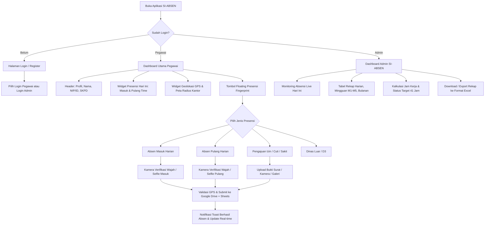

# PRODUCT REQUIREMENT DOCUMENT (PRD)
## SISTEM INFORMASI ABSENSI PEGAWAI (SI-ABSEN)

---

### 1. RINGKASAN PRODUK & TUJUAN
**SI-ABSEN** adalah aplikasi absensi pegawai berbasis web-mobile (Google Apps Script / Web App & PWA) yang mengadaptasi antarmuka modern terinspirasi dari aplikasi presensi instansi/SIPP. Sistem ini memvalidasi kehadiran secara akurat menggunakan verifikasi foto/wajah (face snapshot), geolokasi/GPS kantor, serta mengelola pencatatan izin, cuti, dan sakit. 

Semua data tersinkronisasi otomatis secara real-time ke **Google Sheets** dan dokumen/foto bukti otomatis tersimpan rapi di **Google Drive**, lengkap dengan kalkulasi jam kerja terhadap target **41 jam per minggu** serta ekspor laporan ke **Excel**.

---

### 2. PENGGUNA & HAK AKSES (USER ROLES)

| Role | Akses & Wewenang |
|---|---|
| **Pegawai / User** | - Registrasi & Login dengan Email.<br>- Profil Pegawai (Nama Lengkap, NIP/ID, Unit Kerja/SKPD).<br>- Melakukan Absen Masuk & Pulang dengan Verifikasi Kamera/Wajah.<br>- Mengajukan Izin, Sakit, Cuti beserta bukti foto/dokumen (Kamera/Galeri).<br>- Melihat status GPS / Radius Lokasi Kantor.<br>- Melihat riwayat & rekap absensi pribadi (harian, mingguan, bulanan, capaian jam kerja). |
| **Administrator** | - Login khusus Admin.<br>- Kelola data pegawai (lihat daftar user, reset password/status).<br>- Melihat & memvalidasi rekap kehadiran seluruh pegawai secara real-time.<br>- Akses rekap Harian, Mingguan (M1-M5), dan Bulanan.<br>- Filter data berdasarkan periode, divisi, nama, atau status (Terlambat, Pulang Cepat, Izin, Cuti, Sakit, Tidak Absen).<br>- Unduh / Export Rekap Absensi ke format **Excel (.xlsx / .csv)** & Cetak PDF.<br>- Konfigurasi target jam kerja & radius GPS kantor. |

---

### 3. ATURAN JAM KERJA & LOGIKA PERHITUNGAN

#### A. Jadwal Jam Kerja Standar
| Hari | Jam Masuk Standar | Jam Pulang Standar | Durasi Standar |
|---|---|---|---|
| **Senin – Kamis** | **07:30** WIB | **15:00** WIB | 7.5 Jam (7 Jam 30 Menit) |
| **Jumat** | **07:00** WIB | **11:30** WIB | 4.5 Jam (4 Jam 30 Menit) |
| **Sabtu** | **07:00** WIB | **13:00** WIB | 6.0 Jam (6 Jam 00 Menit) |
| **Minggu** | Libur Rutin | Libur Rutin | - |

> **Total Standar Jam Normal per Minggu**: $(4 \times 7.5) + 4.5 + 6.0 = 30 + 4.5 + 6 = 40.5 \approx$ **Target 41 Jam / Minggu**.

#### B. Logika Keterlambatan & Pulang Cepat
1. **Terlambat Masuk**: Jika jam absen masuk $> \text{Jam Masuk Standar}$ (dihitung selisih menit keterlambatan).
2. **Tepat Waktu**: Jika jam absen masuk $\le \text{Jam Masuk Standar}$.
3. **Pulang Awal / Cepat**: Jika jam absen pulang $< \text{Jam Pulang Standar}$ (dihitung selisih menit kurang).
4. **Perhitungan Jam Kerja Efektif Harian**:
   $$\text{Jam Kerja} = \text{Jam Pulang Aktual} - \text{Jam Masuk Aktual} \quad (\text{dalam format Jam & Menit})$$
5. **Keterangan Tidak Absen**:
   - Jika pegawai tidak melakukan absen masuk & pulang pada hari kerja tanpa surat izin/cuti/sakit $\rightarrow$ **Status: Alpa / Tidak Hadir (0 Jam)**.
   - Jika pegawai hanya absen masuk tapi tidak absen pulang $\rightarrow$ **Status: Tidak Absen Pulang** (Dihitung jam kerja standar parsial atau diberi peringatan pada rekap).

#### C. Akumulasi & Target Jam Kerja
- **Rekap Mingguan (M1, M2, M3, M4, M5)**:
  - Penjumlahan akumulasi jam kerja efektif dalam satu minggu (Senin - Sabtu).
  - Indikator pencapaian: **Target = 41 Jam/Minggu**.
  - Status Mingguan: *Tercapai ($\ge 41$ Jam)* atau *Kurang ($< 41$ Jam, tertera selisih minus)*.
- **Rekap Bulanan**:
  - Total jam kerja aktual sebulan, rata-rata jam kerja harian, persentase kehadiran, jumlah keterlambatan, izin, sakit, cuti, dan alpa.

---

### 4. STRUKTUR SHEET & INTEGRASI GOOGLE DRIVE

Sistem terhubung langsung ke **Google Spreadsheet** dan **Google Drive**:

```
📁 SI_ABSEN_DRIVE (Root Folder)
   └── 📁 EVIDENCES (Folder Foto Verifikasi Wajah, Surat Dokter, Surat Izin)
```

#### A. Sheet 1: `Absen Masuk`
| Kolom | Nama Kolom | Keterangan |
|---|---|---|
| A | `Timestamp` | Format `DD/MM/YYYY HH:mm:ss` (Waktu submit) |
| B | `Email Address` | Email akun pegawai |
| C | `Nama` | Nama lengkap pegawai |
| D | `Kehadiran` | Opsi: `Masuk`, `Izin`, `Sakit`, `Cuti` |
| E | `Bukti Kehadiran/Surat/Izin` | Link file Google Drive (`https://drive.google.com/open?id=...`) |
| F | `Nama-Tanggal-Keterangan` | Format gabungan contoh: `Agung Siswoyo-46235-Masuk` |
| G | `Tanggal` | Tanggal absensi (`DD/MM/YYYY`) |
| H | `Jam` | Waktu absen masuk (`HH:mm:ss`) |
| I | `Status_Masuk` | `Tepat Waktu` / `Terlambat X Menit` |
| J | `Lokasi_GPS` | Koordinat Lat, Long / Status Radius |

#### B. Sheet 2: `Absen Pulang`
| Kolom | Nama Kolom | Keterangan |
|---|---|---|
| A | `Timestamp` | Format `DD/MM/YYYY HH:mm:ss` |
| B | `Email Address` | Email akun pegawai |
| C | `Nama` | Nama lengkap pegawai |
| D | `Bukti Pulang` | Link file foto selfie/wajah pulang di Google Drive |
| E | `Nama-Tanggal-Keterangan` | Format gabungan contoh: `Agung Siswoyo-46235-Pulang` |
| F | `Tanggal` | Tanggal absensi (`DD/MM/YYYY`) |
| G | `Jam` | Waktu absen pulang (`HH:mm:ss`) |
| H | `Status_Pulang` | `Sesuai Jam` / `Pulang Awal X Menit` |
| I | `Jumlah_Jam_Kerja` | Durasi jam kerja hari tersebut (contoh: `07:18:12`) |

#### C. Sheet Rekap Mingguan (`REKAP MO1`, `REKAP M2`, `REKAP M3`, `REKAP M4`, `REKAP M5`)
- Berisi matriks kehadiran pegawai per tanggal dalam pekan tersebut (Senin s/d Sabtu).
- Detail per hari: Jam Masuk, Jam Pulang, Durasi Jam Kerja, Status.
- Total Jam Kerja Minggu Ini vs Target 41 Jam.

#### D. Sheet `REKAP TOTAL PERMINGGU` & `REKAP BULANAN (SEPTEMBER / BERJALAN)`
- Ringkasan total jam kerja M1 s/d M5 per pegawai.
- Total Jam Kerja 1 Bulan, Total Hari Masuk, Total Izin, Sakit, Cuti, Alpa.
- Status pemenuhan jam kerja instansi.

---

### 5. SPESIFIKASI FITUR & ALUR PENGGUNA (USER FLOW)



---

### 6. DETAIL FITUR & ANTARMUKA (UI/UX)

#### A. Tampilan Dashboard Pegawai (Sesuai Referensi Gambar SIPP)
1. **Header Modern SIPP Style**:
   - Header atas dengan menu burger, Judul **SI-ABSEN v5.6** (atau varian nama instansi), ikon notifikasi lonceng, dan badge status server aktif hijau.
   - Slogan running banner / text: *"ASN Berintegritas | Tolak Gratifikasi | Anti Pungli"*.
   - **Kartu Profil Pegawai**:
     - Avatar foto profil dengan indikator online hijau.
     - Nama Lengkap (contoh: `AGUNG SISWOYO`).
     - NIP / ID Pegawai (contoh: `199407312025211093`).
     - Badge SKPD / Unit Kerja (contoh: `UPTD Puskesmas Cermee`).
2. **Card "Presensi Hari Ini"**:
   - Tanggal berjalan lengkap (contoh: `Kamis, 03 September 2026`).
   - Kolom **Masuk**: Waktu Masuk (contoh: `07:42:53`) + Badge Status (`HARIAN_MASUK`).
   - Kolom **Pulang**: Waktu Pulang (contoh: `-- : --` jika belum atau jam pulang jika sudah).
   - Tombol **"SELENGKAPNYA"** untuk membuka detail riwayat hari ini.
3. **Card "Lokasi Anda & GPS"**:
   - Status indikator: `🟢 GPS Aktif` / `Akurasi: ±X meter`.
   - Tombol `Refresh Peta 🔄`.
   - Mini Map visual interaktif menunjukkan pin lokasi pegawai dan radius area kantor (misal 50-100 meter).
4. **Floating Action Button (FAB) Fingerprint**:
   - Tombol lingkaran elegan di bottom navbar untuk memunculkan modal popup pilihan presensi.
5. **Modal Popup Presensi (Sesuai Gambar 2 & 3)**:
   - Menu Opsi: **Harian**, **D3 / Shift**, **Dinas Luar**, **Mode Test**.
   - Sub-modal Absensi Harian: Dua tombol besar dengan ikon jam kalender:
     - **MASUK** (Ikon Cyan/Biru Jam Masuk)
     - **PULANG** (Ikon Merah Jam Pulang)
   - Menu Khusus: **Izin**, **Sakit**, **Cuti** dengan upload surat/bukti.
6. **Modal Kamera Verifikasi Wajah (Face Snapshot)**:
   - Akses kamera depan otomatis dengan frame oval/lingkaran panduan wajah.
   - Deteksi tangkapan wajah real-time + preview sebelum kirim.
   - Kompresi gambar otomatis agar cepat ter-upload ke Google Drive tanpa memberatkan koneksi.

#### B. Tampilan Dashboard Administrator
1. **Statistik Kehadiran Harian**:
   - Total Pegawai Hadir Tepat Waktu, Terlambat, Izin, Sakit, Cuti, dan Belum Absen / Alpa.
2. **Tabel Rekap Multi-Tab**:
   - Tab 1: **Absen Masuk** (Live data + link foto selfie).
   - Tab 2: **Absen Pulang** (Live data + jam pulang + jam kerja).
   - Tab 3: **Rekap Mingguan (M1 - M5)** dengan kalkulasi target **41 Jam/Minggu**.
   - Tab 4: **Rekap Bulanan** (Akumulasi total jam kerja, persentase kehadiran).
3. **Fitur Filter & Pencarian**:
   - Filter berdasarkan Tanggal, Rentang Minggu, Nama Pegawai, atau Status Kehadiran.
4. **Fitur Ekspor Excel**:
   - Tombol **"Download Excel (.xlsx)"** yang mengekspor seluruh sheet rekap rapi dengan format tabel, warna indikator, dan formula siap cetak.

---

### 7. ARSITEKTUR TEKNIS & STRUKTUR FOLDER (REACT.JS + VITE)

1. **Frontend Stack**:
   - **Framework**: React.js (Vite)
   - **Styling**: Modern Vanilla CSS Design System with CSS Variables, Glassmorphism, & SIPP Teal Theme (#00838F / #0097A7)
   - **Icons**: Lucide React Icons
   - **Camera & Face Verification**: HTML5 Canvas & `navigator.mediaDevices.getUserMedia` (Direct Device Camera Access, Oval Face Guide, Snapshot Preview & Base64 Compression)
   - **Geolocation & Map**: HTML5 Geolocation API + Leaflet / Canvas Interactive Radar Map
   - **Excel Export**: SheetJS (`xlsx`) untuk download rekap Harian, Mingguan (M1-M5), dan Bulanan
   - **Storage & State**: React State + Context API + LocalStorage Persistent Cache + Webhook Sync ke Google Apps Script (Drive & Sheets Backend API)

2. **Rincian Struktur Folder (Modular & Clean Architecture)**:
   ```
   SI-ABSEN/
   ├── public/
   │   ├── favicon.ico
   │   └── manifest.json
   ├── src/
   │   ├── assets/               # Gambar, logo, ikon statis
   │   ├── components/           # Komponen UI Reusable
   │   │   ├── common/           # Button, Modal, Card, Input, Badge, Toast
   │   │   ├── camera/           # CameraCapture, FaceGuideOverlay, ImagePreview
   │   │   ├── map/              # LocationMap, GpsStatusIndicator
   │   │   └── layout/           # Header, TopBanner, BottomNav, SidebarAdmin
   │   ├── contexts/             # Context Provider (AuthContext, AttendanceContext)
   │   ├── hooks/                # Custom Hooks (useCamera, useGeolocation, useAttendance)
   │   ├── pages/                # Halaman Utama
   │   │   ├── auth/             # LoginPage, RegisterPage
   │   │   ├── user/             # UserDashboard, UserProfile, UserHistory, LeaveRequestPage
   │   │   └── admin/            # AdminDashboard, EmployeeManagement, WeeklyRecapPage, MonthlyRecapPage
   │   ├── services/             # Integrasi API & Sync
   │   │   ├── api.js            # Konektor Google Apps Script Webhook (Google Sheets/Drive)
   │   │   ├── storage.js        # Local Database Sync & Offline Support
   │   │   ├── excelExport.js    # Generator Rekap Excel (.xlsx) M1-M5 & Bulanan
   │   │   └── attendanceLogic.js # Kalkulasi Keterlambatan, Pulang Awal, & Target 41 Jam
   │   ├── utils/                # Helper date, format, validator
   │   │   ├── dateUtils.js      # Format tanggal, hari, jam kerja
   │   │   └── calculateHours.js # Rumus jam kerja 41 jam/minggu (Senin-Kamis, Jumat, Sabtu)
   │   ├── styles/               # CSS Design System
   │   │   ├── index.css         # Global Reset, Typography, CSS Variables
   │   │   ├── sipp-theme.css    # SIPP v5.6 Theme Styles & Glassmorphism
   │   │   └── components.css    # Component Specific Styles
   │   ├── App.jsx               # Main Router & Layout Switcher
   │   └── main.jsx              # Entry Point
   ├── backend-gas/              # Script Google Apps Script untuk Webhook API
   │   └── Code.gs               # Endpoint DoPost / DoGet untuk sync Sheets & Drive
   ├── index.html
   ├── package.json
   └── vite.config.js
   ```
