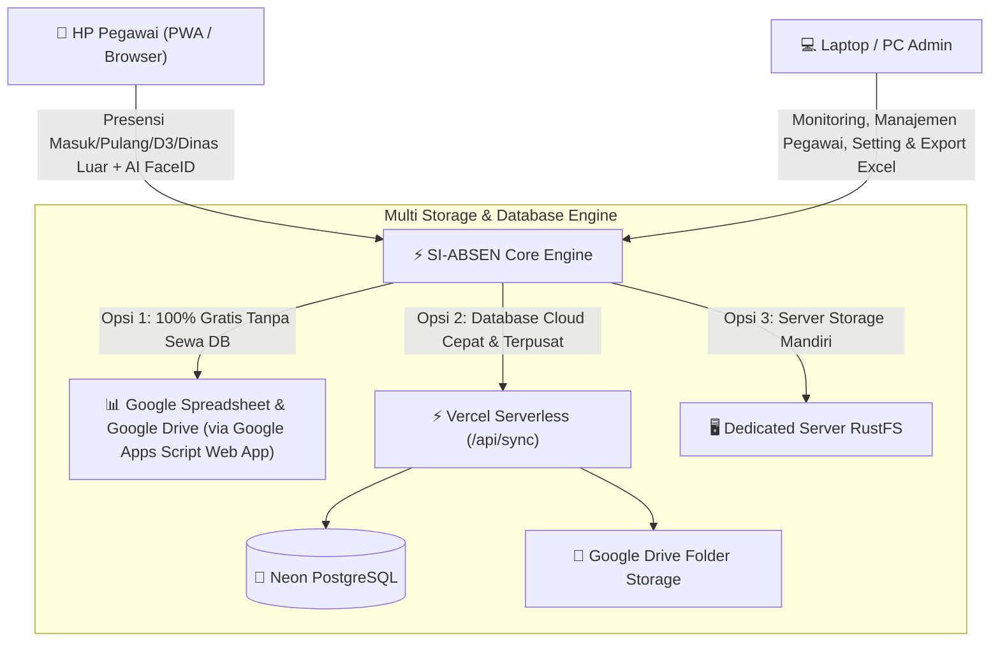

# 📌 SI-ABSEN: Master Context & Obsidian Documentation Hub

Dokumentasi komprehensif ini merangkum seluruh arsitektur, modul biometrik **AI Face Recognition & Liveness Test**, **3 Pilihan Mesin Database (Google Spreadsheet GAS, Vercel Postgres Neon, & Dedicated Server RustFS)**, modul **6 Jenis Presensi (Harian, 3-Shift, D3, Dinas Luar 1x Wajah, Izin/Sakit/Cuti)**, sistem geofencing Google Maps, laporan rekapitulasi multi-sheet Excel, serta panduan setup custom domain dan penjualan source code.

---

## 🏗️ 1. Arsitektur Cloud & Multi-Engine Database

| Komponen | Teknologi | Keterangan |
| :--- | :--- | :--- |
| **Frontend Framework** | **React.js 18 + Vite** | Single Page Application responsif dengan PWA support (*offline-ready*). |
| **UI/UX Styling** | **Vanilla CSS + Lucide Icons** | Mengadopsi visual resmi **SIPP v5.6** (Puskesmas Cermee). |
| **Biometrik & Face Recognition** | **MediaPipe FaceMesh + Face Descriptor Matching** | Pendaftaran wajah saat registrasi & verifikasi biometrik 1:1 saat absen. |
| **Pilihan Database 1 (Gratis)** | **Google Spreadsheet + Google Apps Script (GAS)** | 100% gratis, data langsung tersimpan ke Google Sheet & foto ke Google Drive. |
| **Pilihan Database 2 (Cloud)** | **Vercel Postgres (Neon) + Google Drive** | Database SQL cloud permanen, performa tinggi, foto di Google Drive. |
| **Pilihan Database 3 (Dedicated)**| **Dedicated Server (RustFS)** | Unggah foto bukti langsung ke VPS / server file storage mandiri. |
| **Export Engine** | **SheetJS (xlsx)** | Menghasilkan workbook multi-sheet (*Absen Masuk, Pulang, DL, Izin, D3, Rekap Semua, M1-M5, Bulanan*). |
| **Geofencing & Peta** | **Leaflet + Google Maps** | Validasi radius presensi kantor dengan deteksi GPS live. |

---

## 👥 2. Modul Biometrik AI Face Recognition & Liveness Detection

> [!TIP]
> **Pendaftaran Wajah Saat Registrasi**:
> Setiap pegawai baru yang mendaftar akun wajib melakukan scan wajah pertama kali. Sistem mengekstrak vektor deskriptor wajah biometrik dan menyimpannya ke database.

### Alur Verifikasi Presensi:
1. **Pendeteksian Kontur Wajah**: Titik hijau (*mesh landmarks*) mendeteksi posisi mata, hidung, bibir, dan rahang.
2. **Uji Kedipan Mata (*Liveness Test*)**: Mengukur rasio bukaan kelopak mata (*eyelid landmarks*) dan memvalidasi kedipan mata 1x.
3. **Pencocokan Biometrik 1:1**: Membandingkan wajah di depan kamera dengan foto master wajah saat registrasi.
4. **Anti Titip Absen**: Jika wajah berbeda, sistem menampilkan peringatan *"Wajah Tidak Cocok! Titip Absen Ditolak"*.

---

## 🎯 3. Manajemen 6 Jenis Presensi Pegawai

Sistem mendukung 6 mode presensi lengkap:

### 1. 🏢 Dinas Harian (Pagi)
- **Jadwal Kerja**: Senin–Kamis (07:30–15:00), Jumat (07:00–11:30), Sabtu (07:00–13:00).
- **Target**: **41 Jam / Minggu**.
- **Alur**: Absen Masuk (Scan Wajah) & Absen Pulang (Scan Wajah + Hitung Durasi).

### 2. 🔄 Dinas Muter (3-Shift)
- **Shift Pagi**: `07:00 – 14:00` (7 Jam)
- **Shift Sore**: `14:00 – 21:00` (7 Jam)
- **Shift Malam**: `21:00 – 07:00` (10 Jam, kalkulasi lintas pergantian hari / *cross-midnight*).
- **Alur**: Pilih shift ➔ Absen Masuk ➔ Absen Pulang.

### 3. 💼 Presensi Program D3
- **Alur Baru**: Dilengkapi sub-menu **MASUK D3** & **PULANG D3**.
- **Kalkulasi**: Menghitung otomatis jam kerja antara D3 Masuk & D3 Pulang.
- **Rekapitulasi**: Dicatat pada kolom khusus D3 dan diakumulasikan ke target jam kerja.

### 4. ✈️ Presensi Dinas Luar (Absen Wajah 1x Tanpa Pulang)
- **Alur Mandiri**: Pegawai langsung scan wajah di lokasi tugas dinas luar.
- **Bypass Kunci Lokasi Kantor**: Geofencing kantor dilewati otomatis karena penugasan berada di luar instansi.
- **Tanpa Perlu Absen Pulang**: Otomatis tercatat hadir penuh **1x seharian (7 Jam kerja)**.

### 5. 📝 Pengajuan Izin, Sakit & Cuti (Terpisah Mandiri)
- **3 Opsi Surat**:
  - **Izin**: Izin keperluan pribadi / dinas tertentu.
  - **Sakit**: Dilengkapi unggah foto surat dokter.
  - **Cuti**: Cuti tahunan / cuti penting.
- Dilengkapi periode tanggal mulai & selesai, alasan lengkap, dan preview dokumen foto.

### 6. ⚙️ Mode Test Presensi
- Simulasi kamera dan koordinat GPS untuk kebutuhan pelatihan pegawai.

---

## 📊 4. Modul Laporan & Export Multi-Sheet Excel

Dashboard Admin menyediakan tombol **"Unduh Excel Rekap"** yang menghasilkan file `.xlsx` berisi 8 lembar kerja lengkap:

1. **Sheet 1: `Absen Masuk`** (Log presensi masuk Harian, Shift, D3).
2. **Sheet 2: `Absen Pulang`** (Log presensi pulang Harian, Shift, D3 beserta durasi kerja).
3. **Sheet 3: `Daftar Dinas Luar`** (Log dinas luar, lokasi penugasan, foto bukti lapangan).
4. **Sheet 4: `Daftar Izin & Cuti`** (Log izin, sakit, cuti, surat dokter, tanggal mulai-selesai).
5. **Sheet 5: `Daftar D3`** (Log presensi D3 Masuk & Pulang).
6. **Sheet 6: `REKAP SEMUA JENIS`** (Tabel komparatif per pegawai: Hadir Harian, Shift, D3, DL, Izin, Sakit, Cuti, Total Jam 1 Bulan, Evaluasi Target).
7. **Sheet 7: `REKAP M1 s/d M5`** (Matriks kehadiran mingguan per tanggal).
8. **Sheet 8: `REKAP BULANAN`** (Statistik akumulasi bulanan seluruh pegawai).

---

## 💼 5. Strategi Jual Beli Source Code & Deployment Konsumen

> [!NOTE]
> **Model Bisnis**:
> Anda menjual akses source code / lisensi repositori GitHub. Pembeli dapat memilih cara deployment:
> 1. **Versi Gratis / Tanpa Biaya Database (Google Spreadsheet & GAS)**: Pembeli hanya perlu deploy frontend di Vercel gratis (`nama.vercel.app`) dan menyalin kode template `Code.gs` ke Spreadsheet milik mereka.
> 2. **Versi Berbayar / Custom Domain Instansi**: Pembeli menghubungkan database Vercel Postgres dan memasang domain instansi (`absen.namasekolah.sch.id` atau `absen.perusahaan.com`).

---

## 📖 6. Panduan Setup Custom Domain & DNS Record

| Tipe Domain | Type Record | Name / Host | Target / Value |
| :--- | :--- | :--- | :--- |
| **Subdomain** (misal: `absen.instansi.go.id`) | `CNAME` | `absen` | `cname.vercel-dns.com` |
| **Root Domain** (misal: `perusahaan.com`) | `A` | `@` | `76.76.21.21` |

> [!IMPORTANT]
> Sertifikat SSL (HTTPS) diterbitkan dan diperbarui secara otomatis & gratis oleh Vercel.

---

## 🔒 7. Kredensial Administrator Default

- **URL Admin**: `/administrator/login`
- **Email**: `admin@siabsen.go.id`
- **Password**: `admin` *(Sistem mewajibkan penggantian password pada login pertama)*.
